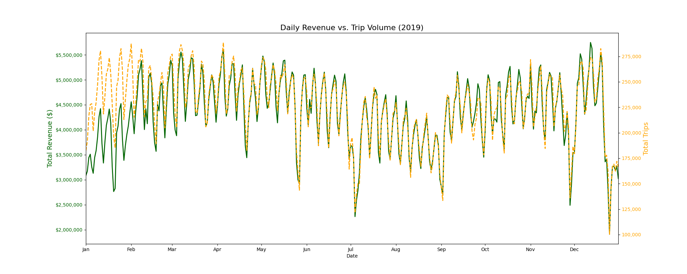
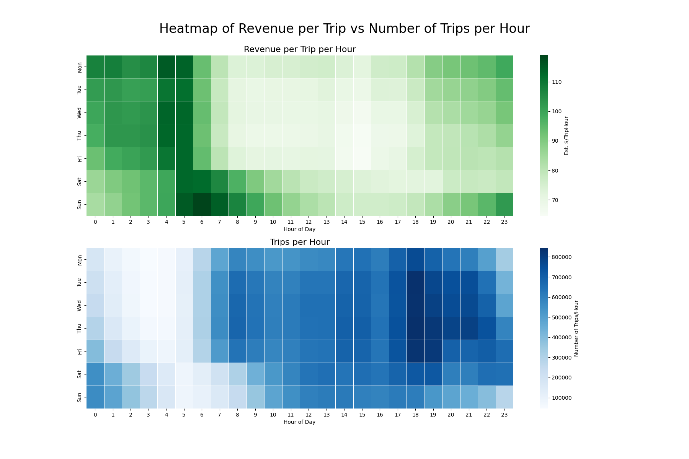
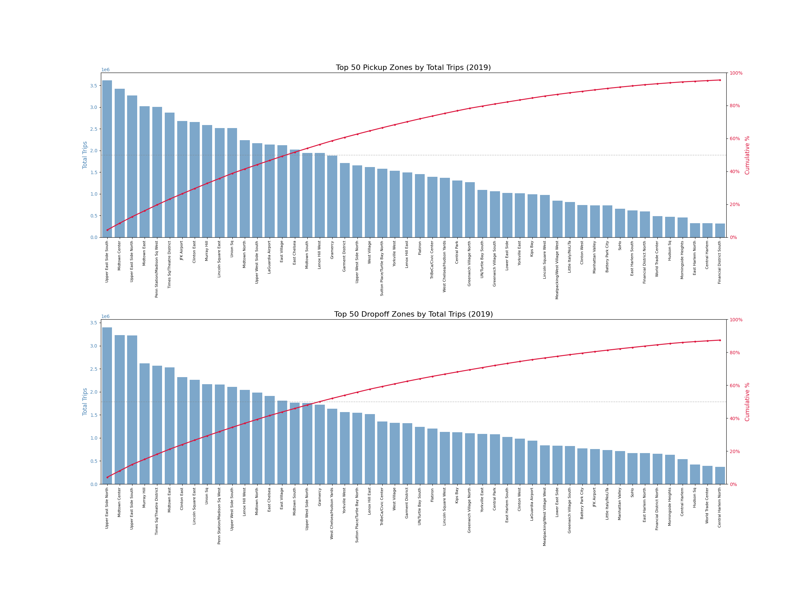

# NYC Yellow Taxi Data Analysis 🚕 (2019)

**Course**: AIT2006
\
**Group**: AIT2006-4-1.11
\
**Members**: Ta Manh Cuong, Nguyen Minh Huy, Nguyen Viet Hung

## Table of Contents

- [Description](#description)
- [Installation](#installation)
- [Project Structure](#project-structure)
- [Usage](#usage)
- [Key Findings](#key-findings)

## Description

This project analyzes New York City Yellow Taxi trip records from the year 2019.

Data cleaning, validation, and exploratory analysis were conducted using Python, followed by visualization to highlight temporal and economic trends within the taxi industry.

## Installation

### 1. Prerequisites:

- Python 3.10 or higher
- Git
- Virtual environment **(Recommended)**

### 2. Repository Setup:
- Clone the repository:
```bash
git clone https://github.com/24022356-max/2526-LTXLDL-finalsProject-AIT2006-4-1.1
cd 2526-LTXLDL-finalsProject-AIT2006-4-1.1
```
- **(Recommended)** Create and activate a virtual environment:
```bash
python -m venv venv
source venv/bin/activate      # macOS/Linux
venv\Scripts\activate         # Windows
```
- Install required Python dependencies:
```bash
pip install -r requirements.txt
```

## Project Structure

- `src/`: Python scripts and notebooks for data preprocessing and analysis.
- `raw/`: Folder for raw NYC Yellow Taxi Parquet files.
\
*(Not uploaded to GitHub due to size).*
- `processed/`: Cleaned datasets and aggregated CSV outputs.
\
*(Not uploaded to GitHub due to size).*
- `reports/`: Quality assurance and validation reports.
- `figures/`: Generated charts and visualizations
- `requirements.txt`: Python dependencies.

## Usage

### 1. Data Acquisition:

The raw data is obtained from the [NYC TLC Trip Record Data repository](https://www.nyc.gov/site/tlc/about/tlc-trip-record-data.page).

Download these files and store them in the `raw/` directory:
- **Trip Records**: 12 Yellow Taxi Parquet files for **2019** (e.g., `yellow_tripdata_2019-01.parquet`).
- **Taxi Zone Lookup Table**

### 2. Data Preprocessing and Aggregation:

Clean and aggregate the raw data using the provided Python scripts in the `src/` directory.

Run the following commands from the root directory of the repository:

   ```bash
   python src/clean_data.py
   python src/aggregate.py
   ```

Upon completion, the output of *12* cleaned Parquet files and *7* aggregated CSV files should be saved to `processed/`.

### 3. Data Visualization:

Pre-generated plots are available in the `figures/` directory.

To reproduce or modify the visualizations, rerun the cells in the `visualize.ipynb` notebook:

   ```bash
   python -m notebook src/visualize.ipynb
   ```

## Key Findings

### 1. Temporal Trends & Seasonality

Daily revenue and trip volume track closely throughout the year, exhibiting a strong positive correlation. However, two distinct patterns emerge:

- **The "January Gap":** A notable divergence occurs in **January**, where revenue is disproportionately low compared to trip volume. This suggests a lower average transaction value (fare) during the post-holiday season.

- **Holiday Declines:** Both metrics show sharp declines during major US holidays, most significantly on Independence Day (July 4th), Thanksgiving (November 28th), and Christmas (December 25th).



### 2. Temporal Revenue Efficiency
An analysis of Revenue per Trip vs. Trip Frequency reveals an inverse relationship during early morning hours.

- **High-Value / Low-Volume:** Between **04:00 and 06:00**, trip volume is at its daily minimum, yet the **average revenue per trip peaks**. This suggests a prevalence of long-distance travel (likely airport transfers) during these hours.
- **High-Volume / Lower-Value:** Weekday evenings **(18:00 - 20:00)** exhibit the highest trip density but lower average fares, indicating short-distance commuter trips.



### 3. Geographic Concentration

Trip demand is highly concentrated within specific Manhattan neighborhoods, following a Pareto distribution.

- **Top Zones:** **Upper East Side (South & North)** and **Midtown Center** consistently rank as the highest volume locations for both pick-ups and drop-offs.

- **Cumulative Impact:** As shown by the cumulative percentage line (red), the top **~20 zones account for 50% of all trips**, while the remaining hundreds of zones share the other half. This highlights the extreme density of taxi operations in Manhattan.

